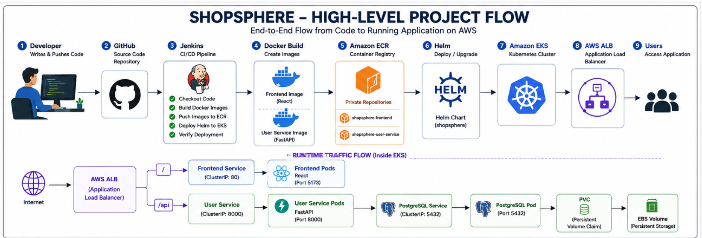
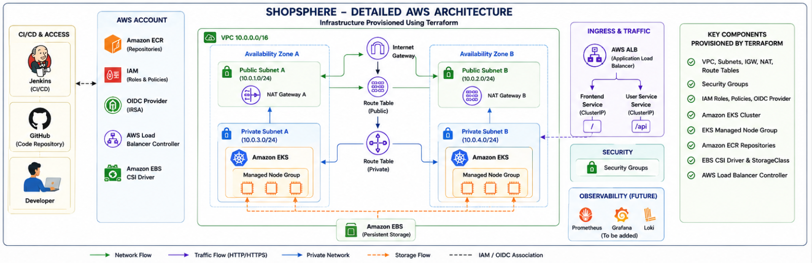

# 🛒 ShopSphere Cloud Platform

ShopSphere is a cloud-native e-commerce DevOps project demonstrating how a containerized application can be provisioned, deployed, exposed, and automated on AWS using modern DevOps practices.

The project combines **Docker, Terraform, AWS EKS, Kubernetes, Helm, Jenkins, Amazon ECR, AWS Application Load Balancer, and EBS persistent storage** to demonstrate an end-to-end cloud deployment workflow.

> **Current application scope:** React frontend, FastAPI user service, and PostgreSQL database.  
> The repository focuses primarily on the cloud infrastructure, Kubernetes deployment, CI/CD, and operational aspects of the platform.

---

## 📌 Project Highlights

- Infrastructure provisioning using **Terraform**
- Highly available AWS networking across **multiple Availability Zones**
- Container orchestration using **Amazon EKS**
- Docker images stored in **Amazon ECR**
- Kubernetes deployments packaged using **Helm**
- Application exposed using **AWS Application Load Balancer**
- ALB integration using the **AWS Load Balancer Controller**
- Persistent PostgreSQL storage using **Amazon EBS CSI**
- Jenkins-based CI/CD pipeline
- Jenkins environment equipped with **Docker CLI, AWS CLI, kubectl, and Helm**
- Kubernetes ConfigMaps and Secrets for application configuration
- Local development using **Docker Compose**
- Infrastructure designed to be destroyed when not required to reduce AWS cost

---

# 🔄 High-Level Project Flow

The following diagram shows the complete ShopSphere delivery flow,
from source-code changes through CI/CD to the running application on AWS.



### Flow

Developer → GitHub → Jenkins → Docker → Amazon ECR → Helm →
Amazon EKS → AWS ALB → Application


# 🏗 Architecture


The platform is divided into three major layers:

1. **Application Layer**
2. **Kubernetes / AWS Runtime Layer**
3. **CI/CD and Infrastructure Automation Layer**

### High-Level Flow

```text
Developer
    │
    ▼
GitHub Repository
    │
    ▼
Jenkins
    │
    ├── Build Frontend Docker Image
    ├── Build User-Service Docker Image
    │
    ▼
Amazon ECR
    │
    ▼
Helm
    │
    ▼
Amazon EKS
    │
    ▼
AWS Application Load Balancer
    │
    ├───────────────┐
    │               │
    ▼               ▼
Frontend        User Service
React           FastAPI
:5173           :8000
                    │
                    ▼
                PostgreSQL
                    │
                    ▼
                 AWS EBS
```

Terraform provisions the AWS infrastructure required by the platform:

```text
Terraform
   │
   ├── VPC
   ├── Public Subnets
   ├── Private Subnets
   ├── Internet Gateway
   ├── NAT Gateway
   ├── Route Tables
   ├── Security Groups
   ├── IAM Roles
   ├── Amazon EKS
   ├── EKS Managed Node Group
   ├── Amazon ECR
   ├── OIDC / IRSA
   ├── EBS CSI Driver
   └── AWS Load Balancer Controller
```

---

# 🔄 Architecture Flow

### 1. Source Code

Application and infrastructure code are maintained in Git.

### 2. Jenkins

Jenkins checks out the repository and executes the CI/CD workflow.

### 3. Docker

Separate Docker images are created for:

```text
shopsphere-frontend
shopsphere-user-service
```

Images are tagged using the Jenkins build number to provide deployment traceability.

Example:

```text
shopsphere-frontend:42
shopsphere-user-service:42
```

### 4. Amazon ECR

Jenkins authenticates with AWS and pushes the generated images to private Amazon ECR repositories.

### 5. Amazon EKS

The application runs inside the `shopsphere` Kubernetes namespace.

The deployed workloads are:

```text
Frontend
User Service
PostgreSQL
```

### 6. Helm

Helm manages the Kubernetes release and provides configurable deployment values for images, replicas, services, database configuration, storage, and Ingress.

### 7. AWS Application Load Balancer

AWS Load Balancer Controller creates an ALB from the Kubernetes Ingress resource.

Traffic routing:

```text
/       → Frontend Service → React Pods
/api    → User Service     → FastAPI Pods
```

The ALB uses:

```yaml
alb.ingress.kubernetes.io/target-type: ip
```

allowing traffic to be routed directly to Kubernetes pod IPs while the application Services remain `ClusterIP`.

### 8. PostgreSQL and EBS

The User Service communicates with PostgreSQL through Kubernetes service discovery.

```text
User Service
     │
     ▼
shopsphere-postgres
     │
     ▼
PostgreSQL Pod
     │
     ▼
PersistentVolumeClaim
     │
     ▼
EBS CSI Driver
     │
     ▼
AWS EBS Volume
```

---

# 🧰 Technology Stack

| Area | Technology |
|---|---|
| Cloud | AWS |
| Infrastructure as Code | Terraform |
| Containers | Docker |
| Container Registry | Amazon ECR |
| Container Orchestration | Kubernetes / Amazon EKS |
| Package Management | Helm |
| CI/CD | Jenkins |
| Load Balancing | AWS Application Load Balancer |
| Kubernetes Ingress | AWS Load Balancer Controller |
| Persistent Storage | Amazon EBS / EBS CSI |
| Authentication | IAM / OIDC / IRSA |
| Frontend | React / Vite |
| Backend | FastAPI |
| Database | PostgreSQL 17 |
| Local Development | Docker Compose |
| Version Control | Git / GitHub |

---

# 🏗 Detailed AWS Architecture

The ShopSphere AWS infrastructure is provisioned using Terraform and
runs across multiple Availability Zones.



The infrastructure includes:

- VPC with public and private subnets
- Internet Gateway and NAT Gateway
- Public and private route tables
- Amazon EKS
- Managed worker nodes
- Amazon ECR
- IAM roles and policies
- OIDC / IRSA
- AWS Load Balancer Controller
- EBS CSI Driver
- Amazon EBS persistent storage

# 📁 Repository Structure

```text
shopsphere-cloud-platform/
│
├── app/
│   ├── frontend/
│   └── user-service/
│
├── ci/
│   └── jenkins/
│       └── Dockerfile
│
├── infrastructure/
│   └── terraform/
│       ├── provider.tf
│       ├── variables.tf
│       ├── outputs.tf
│       ├── vpc.tf
│       ├── subnets.tf
│       ├── networking.tf
│       ├── nat.tf
│       ├── security-groups.tf
│       ├── iam.tf
│       ├── eks.tf
│       ├── oidc.tf
│       ├── ecr.tf
│       ├── ebs-csi.tf
│       ├── storage-class.tf
│       └── load-balancer-controller.tf
│
├── kubernetes/
│   ├── namespace/
│   ├── deployments/
│   ├── services/
│   ├── configmaps/
│   ├── secrets/
│   ├── pvc/
│   └── ingress/
│
├── helm/
│   └── shopsphere/
│       ├── Chart.yaml
│       ├── values.yaml
│       └── templates/
│
├── monitoring/
│
├── diagrams/
├── docs/
├── Jenkinsfile
├── docker-compose.yml
├── .env.example
├── .gitignore
└── README.md
```

---

# 💻 Local Development

The application can be run locally using Docker Compose.

## Prerequisites

Install:

- Git
- Docker
- Docker Compose

Clone the repository:

```bash
git clone https://github.com/Shubham5034/shopsphere-cloud-platform.git
cd shopsphere-cloud-platform
```

Create the required environment file from the example configuration.

```bash
cp .env.example .env
```

Review the values before starting the application.

Start the application:

```bash
docker compose up -d --build
```

Check running containers:

```bash
docker ps
```

Typical local services:

```text
Frontend       → localhost:5173
User Service   → localhost:8000
PostgreSQL     → localhost:5432
```

Stop the environment:

```bash
docker compose down
```

---

# ☁️ AWS Infrastructure with Terraform

Terraform is responsible for provisioning the AWS infrastructure.

Navigate to:

```bash
cd infrastructure/terraform
```

Initialize Terraform:

```bash
terraform init
```

Format the configuration:

```bash
terraform fmt -recursive
```

Validate:

```bash
terraform validate
```

Preview infrastructure changes:

```bash
terraform plan
```

Provision the environment when required:

```bash
terraform apply
```

> Running the AWS infrastructure may incur charges.

---

## Terraform Infrastructure

The Terraform configuration provisions approximately the following architecture:

```text
AWS
│
└── VPC
    │
    ├── Public Subnet - AZ A
    ├── Public Subnet - AZ B
    │
    ├── Private Subnet - AZ A
    └── Private Subnet - AZ B
         │
         └── Amazon EKS
              │
              └── Managed Worker Nodes
```

Supporting components include:

- Internet Gateway
- NAT Gateway
- Public/private route tables
- Security groups
- IAM roles and policies
- EKS cluster
- Managed node group
- ECR repositories
- IAM OIDC provider
- EBS CSI driver
- EBS StorageClass
- AWS Load Balancer Controller

---

# ☸️ Kubernetes

After the EKS cluster is available, configure local `kubectl` access:

```bash
aws eks update-kubeconfig \
  --region ap-south-1 \
  --name shopsphere-eks
```

Verify connectivity:

```bash
kubectl get nodes
```

Check application resources:

```bash
kubectl get pods -n shopsphere
kubectl get svc -n shopsphere
kubectl get ingress -n shopsphere
```

The application uses the namespace:

```text
shopsphere
```

---

# ⎈ Helm Deployment

The application is packaged as a Helm chart:

```text
helm/shopsphere/
```

Validate the chart:

```bash
cd helm/shopsphere

helm lint .
```

Render Kubernetes resources locally:

```bash
helm template shopsphere .
```

Deploy:

```bash
helm upgrade --install shopsphere . \
  --namespace shopsphere \
  --create-namespace
```

Check the release:

```bash
helm list -n shopsphere
```

Check Kubernetes resources:

```bash
kubectl get pods -n shopsphere
kubectl get svc -n shopsphere
kubectl get ingress -n shopsphere
```

---

# 🚀 Jenkins CI/CD

The project contains a Jenkins Pipeline defined using Pipeline-as-Code:

```text
Jenkinsfile
```

The Jenkins environment is built using:

```text
ci/jenkins/Dockerfile
```

The custom Jenkins image contains:

- Jenkins LTS
- Docker CLI
- AWS CLI v2
- kubectl
- Helm

This enables Jenkins to interact with Docker and AWS directly from pipeline stages.

---

## CI/CD Pipeline Flow

```text
Git Push
   │
   ▼
Jenkins
   │
   ├── Checkout Repository
   │
   ├── Authenticate with AWS
   │
   ├── Build Frontend Image
   │
   ├── Build User-Service Image
   │
   ├── Authenticate with Amazon ECR
   │
   ├── Tag Images with BUILD_NUMBER
   │
   ├── Push Images to ECR
   │
   ├── Configure EKS kubeconfig
   │
   ├── Deploy / Upgrade Helm Release
   │
   └── Verify Kubernetes Resources
   │
   ▼
Amazon EKS
```

Image tags use:

```text
${BUILD_NUMBER}
```

rather than relying only on `latest`.

This provides traceability between:

```text
Jenkins Build
      ↓
Docker Image
      ↓
ECR Image
      ↓
Kubernetes Deployment
```

### CI/CD implementation note

The infrastructure and Kubernetes deployment were built and tested during development. The repository's Jenkinsfile represents the final end-to-end automation workflow for building, publishing, and deploying the application.

The AWS environment may intentionally be destroyed when not in use for cost control, so the final deployment stages require the Terraform-managed infrastructure to exist.

---

# 🔐 Credential & Secret Management

Sensitive credentials are **not committed to the repository**.

Jenkins retrieves AWS credentials from Jenkins Credentials using:

```text
credentialsId: aws-credentials
```

Environment variables are used for local application configuration.

Example files contain placeholders only:

```text
.env.example
app/user-service/.env.example
```

Kubernetes Secret manifests also contain placeholder values rather than real passwords.

For production environments, a managed secret solution such as **AWS Secrets Manager with External Secrets Operator** would be preferred.

---

# 🛡️ Security Practices

The project demonstrates several security practices:

- No AWS access keys stored in Git
- Jenkins Credentials used for AWS authentication
- Application configuration externalized from application code
- Kubernetes Secrets used for sensitive runtime configuration
- EKS IAM integration
- OIDC/IRSA for Kubernetes workloads/controllers
- Private ECR repositories
- Worker workloads placed in private subnets
- Public access handled through an Application Load Balancer

---

# 🔧 Troubleshooting & Engineering Challenges

Building the platform involved resolving several real infrastructure and deployment issues.

## 1. ALB Target Group Port Error

### Problem

AWS Load Balancer Controller reported:

```text
TargetGroup port is empty.
When using Instance targets, your service must be of type
NodePort or LoadBalancer.
```

### Cause

The application Services were `ClusterIP`, while the load balancer initially attempted to use instance targets.

### Resolution

Configured the Ingress with:

```yaml
alb.ingress.kubernetes.io/target-type: ip
```

This allowed ALB target groups to register pod IPs directly.

---

## 2. AWS Load Balancer Controller IAM Permission

### Problem

Ingress provisioning failed with:

```text
AccessDenied:
not authorized to perform:
elasticloadbalancing:CreateRule
```

### Cause

The IAM role used by AWS Load Balancer Controller did not contain all required ELB permissions.

### Resolution

Updated the controller IAM policy and IRSA configuration to provide the required permissions.

After the correction, the Ingress received an AWS ALB DNS address.

---

## 3. Terraform Destroy DependencyViolation

### Problem

Terraform initially failed to delete AWS subnets and the VPC:

```text
DependencyViolation:
The subnet has dependencies and cannot be deleted.
```

### Investigation

AWS ENIs were inspected and were found to belong to the Kubernetes-created Application Load Balancer.

### Resolution

Removed the ALB-dependent resources first and verified remaining:

- ENIs
- Security groups
- subnets
- Internet gateways
- NAT gateways
- EKS resources

The remaining infrastructure could then be removed.

---

## 4. Jenkins Docker Access

### Problem

The standard Jenkins container did not contain Docker:

```text
docker: not found
```

After adding the Docker CLI, Jenkins also initially encountered Docker socket permission issues.

### Resolution

Created a custom Jenkins image containing the required DevOps tools and provided access to the host Docker daemon for the local development environment.

---

## 5. Jenkins AWS CLI

### Problem

Pipeline AWS commands initially failed because:

```text
aws: not found
```

### Resolution

AWS CLI v2 was installed in the custom Jenkins Docker image.

The final Jenkins image contains:

```text
Docker
AWS CLI
kubectl
Helm
```

---

# 💰 Cost Optimization

EKS, NAT Gateway, Application Load Balancer, EC2 worker nodes, and other AWS resources can generate ongoing costs.

The environment is therefore designed as reproducible Infrastructure as Code.

When the environment is no longer required:

```bash
cd infrastructure/terraform
terraform destroy
```

This allows the platform to be recreated when needed while avoiding unnecessary long-running infrastructure charges.

Before destroying infrastructure, Kubernetes-created AWS resources such as ALBs should be removed so that AWS networking dependencies can be released cleanly.

---

# 🧪 Validation Performed

Terraform:

```bash
terraform fmt -recursive
terraform validate
terraform plan
```

Terraform validation:

```text
Success! The configuration is valid.
```

Helm:

```bash
helm lint .
helm template shopsphere .
```

Helm validation:

```text
1 chart(s) linted, 0 chart(s) failed
Helm rendering successful
```

Kubernetes workloads were validated using:

```bash
kubectl get pods -n shopsphere
kubectl get svc -n shopsphere
kubectl get ingress -n shopsphere
```

---

# 🗺️ Future Improvements

The current implementation intentionally focuses on establishing a solid DevOps/cloud foundation.

Future iterations can include:

### Application Architecture

- Product Service
- Cart Service
- Order Service
- Inventory Service
- Notification Service
- Analytics Service

### Platform Components

- Redis
- Apache Kafka
- RabbitMQ
- API Gateway / Kong

### Kubernetes

- Horizontal Pod Autoscaler
- Liveness probes
- Readiness probes
- Pod Disruption Budgets
- Network Policies

### Observability

- Prometheus
- Grafana
- Alertmanager
- Loki
- Centralized dashboards and alerts

### Security

- AWS Secrets Manager
- External Secrets Operator
- IAM role-based Jenkins authentication
- Container vulnerability scanning
- Kubernetes security policies

### CI/CD

- Automated tests before image builds
- Security scanning
- Terraform pipeline stages
- Environment promotion
- Development / staging / production environments
- Automated rollback strategy
- GitOps using Argo CD

---

# 🎯 Skills Demonstrated

This project demonstrates hands-on experience with:

```text
AWS
Terraform
Docker
Kubernetes
Amazon EKS
Amazon ECR
Helm
Jenkins
CI/CD
IAM
OIDC / IRSA
AWS ALB
EBS CSI
Linux
Git
Infrastructure as Code
Containerization
Kubernetes Troubleshooting
AWS Networking
Cloud Cost Management
```

The project was developed incrementally, with infrastructure and deployment issues investigated and resolved throughout the implementation rather than using a prebuilt environment.

---

# 👨‍💻 Author

**Shubham Pandey**

DevOps Engineer

Project focus:

> Cloud Infrastructure • Kubernetes • CI/CD • Automation • Production Troubleshooting

---

## ⭐ About This Repository

ShopSphere is intended as a practical DevOps portfolio project demonstrating the lifecycle of a cloud-native application:

```text
Code
 ↓
Containerize
 ↓
Provision Infrastructure
 ↓
Deploy to Kubernetes
 ↓
Expose through Load Balancer
 ↓
Automate with CI/CD
 ↓
Monitor & Operate
```

The emphasis is not only on deploying an application, but also on understanding the infrastructure, debugging failures, managing dependencies, securing credentials, and making the environment reproducible.